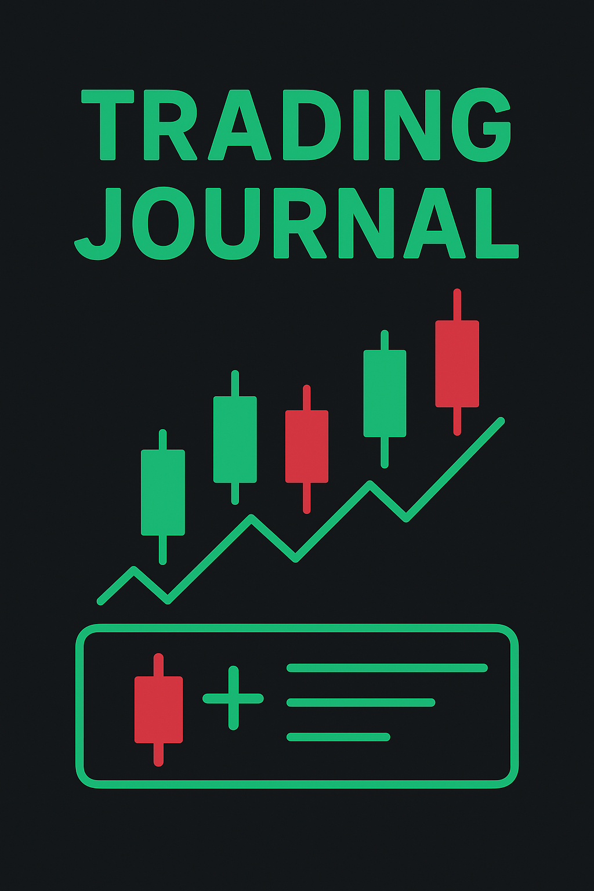

# Commitrade

<p align="center">
  
</p>

> **원칙을 지키는 트레이딩**

감정적 거래와 뇌동매매를 방지하고, 체계적인 매매 원칙을 통해 일관성 있는 트레이딩을 실현하는 **매매일지 플랫폼**입니다.

---

## Why Commitrade?

트레이딩에서 가장 큰 적은 시장이 아닌 **자기 자신**입니다. 감정에 휘둘려 원칙을 저버리는 순간, 손실이 시작됩니다.

Commitrade는 매매 전 **강제적인 체크리스트**와 **타이머**를 통해 충동적인 결정을 막고, 데이터 기반의 합리적인 판단을 돕습니다.

> *"Commit to your rules, trade with discipline."*

<p align="center">
  
</p>

---

## 핵심 기능

| 기능 | 설명 |
|------|------|
| **체크리스트 시스템** | 매매 전 반드시 확인해야 할 원칙들을 체계적으로 점검합니다. |
| **3개 근거 원칙** | 최소 3개 이상의 진입 근거를 요구하며, 그 중 하나는 캔들 패턴이어야 합니다. |
| **30분 분석 타이머** | 충분한 시장 분석 시간을 확보하여 충동적인 매매를 방지합니다. |
| **리스크-리워드 계산** | 손절가와 목표가를 명확히 설정하고 리스크를 관리합니다. |

---

## 트레이딩 원칙

- 감정이 아닌 **데이터**로 트레이딩하기
- 모든 매매에 **명확한 근거** 갖기
- **충분한 분석 시간** 확보하기
- **리스크**를 먼저 생각하기
- 원칙을 **절대 타협하지** 않기

---

## 매매 프로세스

1. **체크리스트 작성** — 진입 근거 3개 이상 작성 (캔들 패턴 1개 필수)
2. **30분 시장 분석** — 타이머를 통해 충분한 분석 시간 확보
3. **리스크-리워드 계산** — 손절가, 목표가, 레버리지 설정 및 검증
4. **매매 실행 및 기록** — 인증서 발급 후 매매 정보 기록 및 추적

---

## 시작하기

### 요구 사항

- Node.js 18+
- npm / yarn / pnpm / bun

### 설치 및 실행

```bash
# 의존성 설치
npm install

# 개발 서버 실행
npm run dev
```

브라우저에서 [http://localhost:3000](http://localhost:3000) 을 열어 확인하세요.

### 환경 변수

Supabase 인증을 사용합니다. 프로젝트 루트에 `.env.local` 파일을 만들고 다음 변수를 설정하세요.

```env
NEXT_PUBLIC_SUPABASE_URL=your_supabase_url
NEXT_PUBLIC_SUPABASE_ANON_KEY=your_supabase_anon_key
```

---

## 기술 스택

- **Framework** — [Next.js](https://nextjs.org) 15 (App Router)
- **Auth** — [Supabase](https://supabase.com) (Google OAuth)
- **UI** — [Tailwind CSS](https://tailwindcss.com), [Radix UI](https://radix-ui.com)
- **State** — [Zustand](https://zustand-demo.pmnd.rs)
- **Charts** — [Recharts](https://recharts.org)

---

## 배포

[Vercel](https://vercel.com)에 배포하는 것을 권장합니다. Supabase URL과 Anon Key는 Vercel 대시보드의 환경 변수에만 설정하면 되며, 저장소에는 포함되지 않습니다.

---

## 라이선스

MIT
